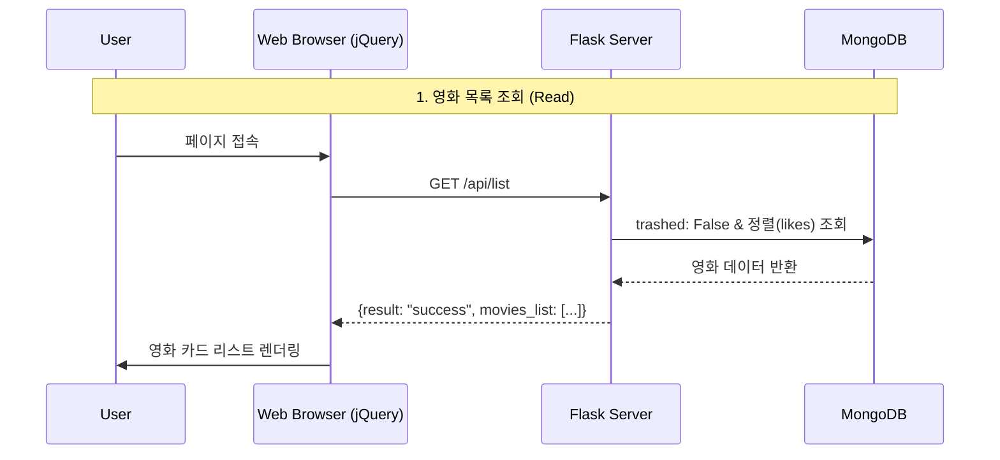
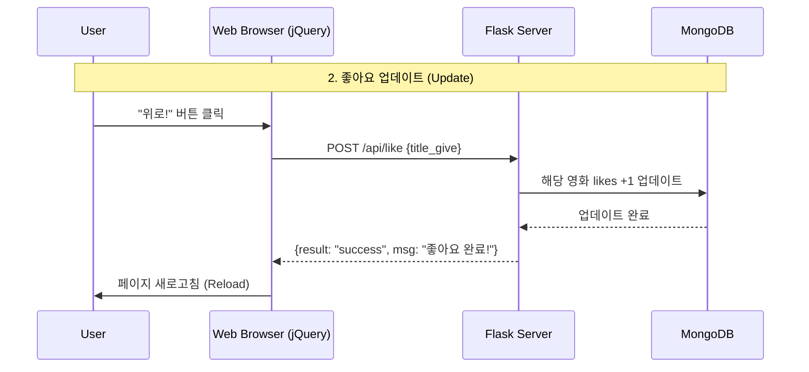
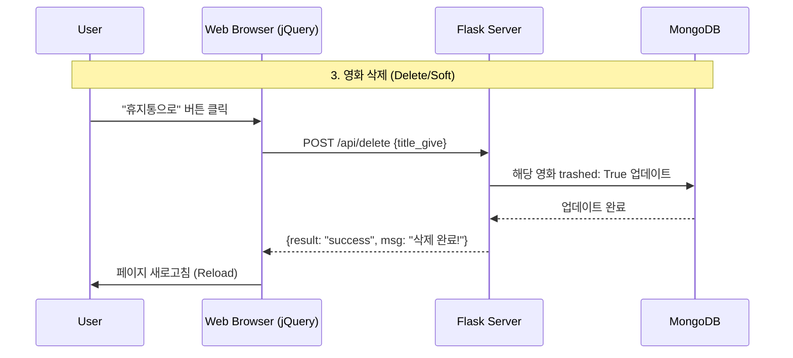
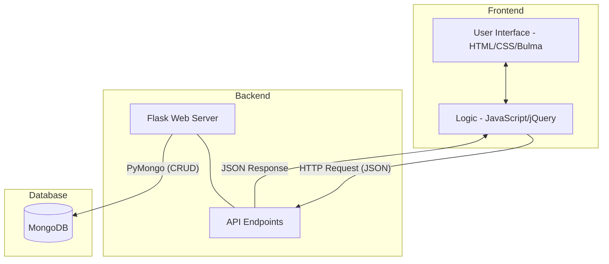

# 🎬 마이 페이보릿 무비 (My Favorite Movie)

이 프로젝트는 영화 데이터를 관리하며, 사용자 인터페이스를 통해 영화 정보를 조회하고 '좋아요' 추천 및 '삭제(휴지통)' 기능을 제공하는 웹 서비스입니다.

## ✨ 주요 기능
- 🎥 **역대 관객 순위 영화 목록 조회** - 다음 검색에서 영화 데이터를 스크래핑하여 DB에 저장
- 👍 **좋아요 기능** - 영화에 좋아요를 추가하고 순위에 반영
- 🗑️ **삭제 기능** - Soft Delete 방식으로 영화를 휴지통으로 이동
- 📊 **정렬 기능** - 좋아요 순으로 영화 목록 정렬
- 🔄 **실시간 업데이트** - 액션 후 자동 새로고침으로 변경사항 즉시 반영

---
## 목차
- [🎬 마이 페이보릿 무비 (My Favorite Movie)](#-마이-페이보릿-무비-my-favorite-movie)
  - [✨ 주요 기능](#-주요-기능)
  - [목차](#목차)
  - [1. Tech Stack](#1-tech-stack)
    - [Backend](#backend)
    - [Frontend](#frontend)
    - [Database](#database)
    - [Development Tools](#development-tools)
  - [2. 주요 기능 및 로직](#2-주요-기능-및-로직)
    - [영화 목록 표시](#영화-목록-표시)
    - ["위로!" (좋아요 업데이트)](#위로-좋아요-업데이트)
    - ["휴지통으로" (삭제 상태 변경)](#휴지통으로-삭제-상태-변경)
  - [3. 시스템 설계](#3-시스템-설계)
    - [💻 프론트엔드 (Client Side)](#-프론트엔드-client-side)
    - [⚙️ 백엔드 (Server Side \& DB)](#️-백엔드-server-side--db)
  - [4. API 설계](#4-api-설계)
    - [공통 에러 응답](#공통-에러-응답)
    - [영화 목록 조회](#영화-목록-조회)
    - [좋아요 업데이트](#좋아요-업데이트)
    - [영화 삭제](#영화-삭제)
  - [5. Database Schema (데이터베이스 스키마)](#5-database-schema-데이터베이스-스키마)
    - [MongoDB Collection: `movies`](#mongodb-collection-movies)
    - [데이터베이스 연결 정보](#데이터베이스-연결-정보)
  - [6. Directory Structure (디렉토리 구조)](#6-directory-structure-디렉토리-구조)
  - [7. Prerequisites (사전 요구사항)](#7-prerequisites-사전-요구사항)
    - [필수 설치 항목](#필수-설치-항목)
    - [설치 확인](#설치-확인)
  - [8. How to Run (실행 방법)](#8-how-to-run-실행-방법)
    - [1️⃣ 프로젝트 클론 및 이동](#1️⃣-프로젝트-클론-및-이동)
    - [2️⃣ 환경 설정 (Setup)](#2️⃣-환경-설정-setup)
    - [3️⃣ 가상환경 활성화](#3️⃣-가상환경-활성화)
    - [4️⃣ MongoDB 실행 확인](#4️⃣-mongodb-실행-확인)
    - [5️⃣ 데이터베이스 초기화](#5️⃣-데이터베이스-초기화)
    - [6️⃣ 애플리케이션 실행](#6️⃣-애플리케이션-실행)
    - [7️⃣ 브라우저에서 접속](#7️⃣-브라우저에서-접속)
    - [🛑 종료 방법](#-종료-방법)
  - [9. 테스트 (Testing)](#9-테스트-testing)
    - [테스트 구조](#테스트-구조)
    - [테스트 실행 방법](#테스트-실행-방법)
      - [모든 테스트 실행](#모든-테스트-실행)
      - [단위 테스트만 실행](#단위-테스트만-실행)
      - [통합 테스트만 실행](#통합-테스트만-실행)
    - [테스트 커버리지](#테스트-커버리지)
    - [테스트 작성 가이드](#테스트-작성-가이드)
  - [10. Development Guide \& Progress](#10-development-guide--progress)
    - [📌 Commit Message Convention](#-commit-message-convention)
    - [✅ Roadmap \& Progress](#-roadmap--progress)
      - [🌱 Branch: `main`](#-branch-main)
      - [🌿 Branch: `feature/sort-function` (정렬 기능 완성)](#-branch-featuresort-function-정렬-기능-완성)
      - [🌿 Branch: `feature/trash-function` (휴지통 기능)](#-branch-featuretrash-function-휴지통-기능)
      - [🌿 Branch: `feature/like-function` (좋아요 기능 완성)](#-branch-featurelike-function-좋아요-기능-완성)
      - [🎨 Branch: `style/ui-enhancement` (UI 개선)](#-branch-styleui-enhancement-ui-개선)
      - [🐛 Branch: `fix/error-handling` (에러 처리)](#-branch-fixerror-handling-에러-처리)
      - [📝 Merge to `main`](#-merge-to-main)
  - [🔍 Troubleshooting \& Challenges](#-troubleshooting--challenges)
  - [📝 License](#-license)

---
## 1. Tech Stack

### Backend
- **Python 3.x**
- **Flask 3.1.2** - 웹 프레임워크
- **PyMongo 4.16.0** - MongoDB 드라이버
- **Werkzeug** - WSGI 유틸리티

### Frontend
- **JavaScript (jQuery 3.5.1)** - DOM 조작 및 AJAX 통신
- **HTML5 / CSS3**
- **Bulma 0.8.0** - CSS 프레임워크
- **Bootstrap 5.3.0** - UI 컴포넌트
- **Font Awesome 6.4.0** - 아이콘

### Database
- **MongoDB** - NoSQL 데이터베이스

### Development Tools
- **BeautifulSoup4** - 웹 스크래핑
- **Requests** - HTTP 라이브러리

---

## 2. 주요 기능 및 로직

### 영화 목록 표시
- 페이지 로딩 완료 후 자동으로 서버에 `GET` 요청을 보냅니다.
- 서버는 DB에서 `trashed` 상태가 `False`인 영화만 필터링합니다.
- 데이터를 **좋아요(Likes)가 많은 순**으로 정렬하여 반환합니다.
- 클라이언트는 받아온 정보를 바탕으로 영화 카드를 동적으로 생성하여 화면에 붙입니다.



### "위로!" (좋아요 업데이트)
- 사용자가 버튼을 클릭하면 영화 제목을 서버로 `POST` 요청 보냅니다.
- 서버는 해당 영화의 좋아요 개수를 찾아 **+1** 하여 DB에 저장합니다.
- 업데이트 성공 시 페이지를 새로고침하여 변경된 순위와 숫자를 반영합니다.



### "휴지통으로" (삭제 상태 변경)
- 사용자가 버튼을 클릭하면 영화 제목을 서버로 `POST` 요청 보냅니다.
- 서버는 해당 영화의 `trashed` 상태 값을 `True`로 업데이트합니다.
- 성공 메시지 반환 후 페이지를 새로고침하여 목록에서 제외합니다.



---

## 3. 시스템 설계

### 💻 프론트엔드 (Client Side)
- **UI 구성**: 포스터, 제목, 개봉일, 관객 수, 좋아요 수가 표시된 카드 리스트
- **상호작용**: "위로!"(좋아요), "휴지통으로"(삭제) 버튼 제공
- **통신 로직**: 
  - 초기 로딩 시 `GET /api/list` 호출
  - 버튼 클릭 시 식별자(제목)를 담아 각 `POST` API 호출

### ⚙️ 백엔드 (Server Side & DB)
- **DB Schema**: `title`, `poster_url`, `info_url`, `open_year`, `open_month`, `open_day`, `viewers`, `likes`, `trashed`(기본값 False)
- **API 역할**:
  - 데이터 필터링(삭제 여부 확인) 및 정렬 로직 수행
  - 식별자를 기반으로 한 DB Document 수정(Update)



---

## 4. API 설계

프론트엔드와 백엔드는 모든 API 통신에서 `result` 값을 확인하여 성공 여부를 판단합니다. 실패 시 `msg`에 담긴 내용을 사용자에게 안내합니다.


### 공통 에러 응답

```json
{
  "result": "fail",
  "msg": "에러 사유 (사용자 노출용 메시지)"
}
```

### 영화 목록 조회
* **Method**: GET
* **Description**: DB에서 삭제되지 않은(`trashed: False`) 영화들을 좋아요 순으로 내림차순 정렬하여 가져옵니다.
* **Endpoint**: `/api/list`
* **Response**:
    ```json
    {
      "result": "success",
      "movies_list": [
        {
          "title": "영화제목",
          "poster_url": "https://...",
          "info_url": "https://search.daum.net/...",
          "open_year": 2014,
          "open_month": 7,
          "open_day": 30,
          "viewers": 17613682,
          "likes": 42,
          "trashed": false
        }
      ]
    }
    ```


### 좋아요 업데이트
* **Method**: POST
* **Description**: 특정 영화의 제목을 받아 해당 영화의 좋아요(`likes`) 수를 1 증가시킵니다.
* **Endpoint**: `/api/like`
* **Request Body**:
    ```json
    {
      "title_give": "영화제목"
    }
    ```
* **Response**:
    ```json
    {
      "result": "success",
      "msg": "좋아요 완료!"
    }
    ```


### 영화 삭제
* **Method**: POST
* **Description**: 특정 영화의 제목을 받아 `trashed` 상태 값을 `True`로 업데이트합니다.
* **Endpoint**: `/api/delete`
* **Request Body**:
    ```json
    {
      "title_give": "영화제목"
    }
    ```
* **Response**:
    ```json
    {
      "result": "success",
      "msg": "삭제 완료!"
    }
    ```

---

## 5. Database Schema (데이터베이스 스키마)

### MongoDB Collection: `movies`

| Field | Type | Description | Example |
|-------|------|-------------|----------|
| `_id` | ObjectId | MongoDB 자동 생성 고유 ID | `ObjectId(...)` |
| `title` | String | 영화 제목 | "명량" |
| `poster_url` | String | 영화 포스터 이미지 URL | "https://..." |
| `info_url` | String | 영화 상세 정보 페이지 URL | "https://search.daum.net/..." |
| `open_year` | Integer | 개봉 연도 | 2014 |
| `open_month` | Integer | 개봉 월 | 7 |
| `open_day` | Integer | 개봉 일 | 30 |
| `viewers` | Integer | 누적 관객 수 | 17613682 |
| `likes` | Integer | 좋아요 수 (랜덤 초기값: 0~99) | 42 |
| `trashed` | Boolean | 삭제 여부 (Soft Delete) | false |

### 데이터베이스 연결 정보
- **호스트**: `localhost`
- **포트**: `27017`
- **데이터베이스명**: `dbjungle`
- **컬렉션명**: `movies`

---

## 6. Directory Structure (디렉토리 구조)

```
moviestar/
├── app.py                  # Flask 메인 애플리케이션 (API 엔드포인트 정의)
├── init_db.py             # MongoDB 초기 데이터 설정 스크립트
├── requirements.txt       # Python 패키지 의존성 목록
├── setup.ps1             # Windows PowerShell 환경 설정 스크립트
├── README.md             # 프로젝트 문서
├── static/               # 정적 파일 (CSS, JS, 이미지 등)
├── templates/            # HTML 템플릿 파일
│   └── index.html       # 메인 페이지 (영화 목록 UI)
├── tests/               # 테스트 파일
└── venv/                # Python 가상 환경 (git ignore)
```

---

## 7. Prerequisites (사전 요구사항)

프로젝트를 실행하기 전에 다음 소프트웨어가 설치되어 있어야 합니다:

### 필수 설치 항목

1. **Python 3.x**
   - [Python 공식 웹사이트](https://www.python.org/downloads/)에서 다운로드
   - 설치 시 "Add Python to PATH" 옵션 체크 필수

2. **MongoDB Community Edition**
   - [MongoDB 다운로드 페이지](https://www.mongodb.com/try/download/community)에서 설치
   - 설치 후 MongoDB 서비스가 실행 중인지 확인:
     ```powershell
     # MongoDB 서비스 상태 확인
     Get-Service -Name MongoDB
     ```
   - 기본 포트: `27017`

3. **PowerShell** (Windows 기본 제공)
   - Windows 10/11에 기본 포함

### 설치 확인

다음 명령어로 설치 여부를 확인할 수 있습니다:

```powershell
# Python 버전 확인
python --version

# MongoDB 연결 테스트
mongosh --eval "db.version()"
```

---

## 8. How to Run (실행 방법)

### 1️⃣ 프로젝트 클론 및 이동

```powershell
git clone <repository-url>
cd moviestar
```

### 2️⃣ 환경 설정 (Setup)

PowerShell 스크립트를 실행하여 가상환경을 생성하고 필요한 패키지를 설치합니다:

```powershell
.\setup.ps1
```

이 스크립트는 다음 작업을 수행합니다:
- 가상환경(`venv`) 생성
- 필수 디렉토리 생성 (`static`, `templates`, `tests`)
- `requirements.txt`에 명시된 모든 Python 패키지 설치

### 3️⃣ 가상환경 활성화

```powershell
.\venv\Scripts\activate
```

### 4️⃣ MongoDB 실행 확인

MongoDB 서비스가 실행 중인지 확인합니다:

```powershell
Get-Service -Name MongoDB
```

만약 실행 중이지 않다면:

```powershell
Start-Service -Name MongoDB
```

### 5️⃣ 데이터베이스 초기화

영화 데이터를 웹 스크래핑하여 MongoDB에 저장합니다:

```powershell
python init_db.py
```

이 스크립트는:
- 다음 검색에서 역대 관객 순위 영화 정보를 스크래핑
- 영화 제목, 포스터, 개봉일, 관객 수 등의 데이터 수집
- `dbjungle` 데이터베이스의 `movies` 컬렉션에 저장

### 6️⃣ 애플리케이션 실행

```powershell
python app.py
```

서버가 정상적으로 시작되면 다음과 같은 메시지가 표시됩니다:

```
 * Running on http://0.0.0.0:5000
 * Debug mode: on
```

### 7️⃣ 브라우저에서 접속

웹 브라우저를 열고 다음 주소로 접속합니다:

```
http://localhost:5000
```

### 🛑 종료 방법

- Flask 서버 종료: 터미널에서 `Ctrl + C`
- 가상환경 비활성화: `deactivate`
- MongoDB 서비스 중지: `Stop-Service -Name MongoDB`

---

## 9. 테스트 (Testing)

코드의 안정성과 기능을 검증하기 위한 테스트를 수행합니다.

### 테스트 구조

```
tests/
├── unit/              # 단위 테스트 (개별 함수/메서드)
└── integration/       # 통합 테스트 (API 엔드포인트)
```

### 테스트 실행 방법

#### 모든 테스트 실행

```powershell
python -m unittest discover tests
```

#### 단위 테스트만 실행

```powershell
python -m unittest discover tests/unit
```

#### 통합 테스트만 실행

```powershell
python -m unittest discover tests/integration
```

### 테스트 커버리지

- **단위 테스트**: 개별 함수의 입출력 검증
- **통합 테스트**: API 엔드포인트의 전체 동작 검증
  - `/api/list` - 영화 목록 조회
  - `/api/like` - 좋아요 기능
  - `/api/delete` - 삭제 기능

### 테스트 작성 가이드

테스트 파일 작성 시 다음 규칙을 따릅니다:
- 파일명: `test_*.py` 형식
- 클래스명: `Test*` 형식
- 메서드명: `test_*` 형식

---

## 10. Development Guide & Progress

프로젝트의 일관성을 위해 아래의 커밋 컨벤션을 준수하며 개발을 진행합니다.

### 📌 Commit Message Convention

- **feat**: 새로운 기능 추가
- **fix**: 버그 수정
- **docs**: 문서 수정 (README, 주석 등)
- **style**: 코드 포맷팅, UI 스타일 변경 (로직 변경 없음)
- **refactor**: 코드 리팩토링 (기능은 동일하나 구조 개선)
- **test**: 테스트 코드 추가/수정
- **chore**: 빌드, 배포, 개발 환경 설정 등 기타 작업

### ✅ Roadmap & Progress

#### 🌱 Branch: `main`
- [x] Initial commit: 프로젝트 기본 구조 및 README 작성 완료
  - Flask 서버 및 MongoDB 연결 설정
  - init_db.py 스크래핑 로직 완성
  - GET /api/list, POST /api/like 기본 구조
  - HTML/CSS/JS 기본 UI 구현
  - jQuery AJAX 영화 목록 표시 기능

#### 🌿 Branch: `feature/sort-function` (정렬 기능 완성)
- [x] feat: 백엔드 - GET /api/list에 .sort() 로직 추가 (likes, viewers, date)
- [x] feat: 프론트엔드 - displaySorter() 함수 완성 (active 클래스 추가)
- [x] feat: 개봉일 순 정렬 기능 구현 (open_year, open_month, open_day 활용)
- [x] test: 정렬 기능 통합 테스트 작성

#### 🌿 Branch: `feature/trash-function` (휴지통 기능)
- [x] feat: 백엔드 - POST /api/delete 엔드포인트 추가
- [x] feat: 백엔드 - GET /api/list/trash 엔드포인트 추가
- [x] feat: 프론트엔드 - trashMovie(title) 함수 완성
- [x] feat: 프론트엔드 - displayTrashMode(trashMode) 함수 완성
- [x] feat: 프론트엔드 - enterTrashMode()/exitTrashMode() 함수 추가
- [x] feat: 카드 버튼 onclick에 title 매개변수 전달 추가
- [x] test: 휴지통 기능 통합 테스트 작성 및 검증

#### 🌿 Branch: `feature/like-function` (좋아요 기능 완성)
- [x] feat: 백엔드 - POST /api/like에 title 매개변수 받도록 수정
- [x] feat: 프론트엔드 - likeMovie(title) 함수에 매개변수 추가
- [x] feat: 카드 버튼 onclick에 title 전달하도록 수정 (이미 완료되어 있음)
- [x] fix: 특정 영화에만 좋아요가 적용되도록 수정
- [x] test: 좋아요 기능 통합 테스트 작성

#### 🎨 Branch: `style/ui-enhancement` (UI 개선)
- [x] style: 영화 포스터 이미지 실제 URL로 교체 및 alt 속성 추가
- [x] style: 개봉일 포맷팅 (YYYY.MM.DD) 및 관객수 천 단위 콤마 추가
- [x] style: 이미지 로드 실패 시 대체 이미지 표시 (onerror 처리)

#### 🐛 Branch: `fix/error-handling` (에러 처리)
- [x] fix: API 에러 응답 처리
- [x] fix: MongoDB 연결 실패 시 에러 처리
- [x] fix: 데이터 검증 및 예외 처리

#### � Branch: `chore/docker` (Docker 환경 구축)
- [x] chore: Dockerfile, docker-compose.yml 추가
- [x] chore: .dockerignore 파일 생성
- [x] chore: GitHub Actions CI 파이프라인 추가 (.github/workflows/test.yml)
- [x] fix: CI Python 버전을 3.10으로 변경 (click 패키지 호환성)
- [x] docs: README에 chore 커밋 컨벤션 추가

#### 🐛 Branch: `fix/docker-env-config` (Docker 환경 설정 수정)
- [x] fix: Dockerfile Python 버전 3.9 → 3.10으로 수정
- [x] fix: app.py, init_db.py에 환경변수 기반 MongoDB 연결 추가
- [x] fix: Docker 네트워크에서 'mongodb' 호스트명 사용하도록 수정

#### 📝 Merge to `main`
- [x] 모든 기능 브랜치 병합 완료
- [x] 통합 테스트 완료
- [x] 주요 기능 개발 완료 (정렬, 휴지통, 좋아요, UI 개선, 에러 처리)
- [x] Docker 환경 및 CI/CD 파이프라인 구축 완료

---

## 🔍 Troubleshooting & Challenges

<details>
<summary><b>1. 데이터 삭제 방식에 대한 고민 (Soft Delete vs Hard Delete)</b></summary>

- **상황**: 사용자가 영화를 삭제할 때 DB에서 데이터를 영구 삭제할지 고민함.
- **선택**: `trashed` 플래그를 사용하는 **Soft Delete** 방식 채택.
- **이유**: 추후 휴지통 복구 기능을 확장할 수 있고, 사용자 데이터 실수 삭제를 방지하기 위함.
</details>

<details>
<summary><b>2. 좋아요 클릭 시 모든 영화의 좋아요가 증가하는 버그</b></summary>

- **상황**: 특정 영화의 "위로!" 버튼을 클릭했는데 모든 영화의 좋아요 수가 증가하는 버그 발생.
- **원인**: 
  - 프론트엔드에서 `likeMovie()` 함수가 영화 제목을 매개변수로 받지 않음
  - 백엔드 API가 특정 영화를 식별하지 못하고 임의의 영화를 업데이트
- **해결**: 
  - `likeMovie(title)` 함수에 title 매개변수 추가
  - 백엔드에서 `request.form.get('title_give')`로 특정 영화 식별
  - MongoDB 쿼리에 `{'title': title_receive}` 필터 조건 추가
- **학습**: 사용자 액션이 특정 데이터에만 영향을 주도록 식별자 전달이 필수적임을 깨달음.
</details>

<details>
<summary><b>3. 기능 브랜치 개발 순서 및 의존성 문제</b></summary>

- **상황**: feature/trash-function과 feature/sort-function을 병렬로 개발하려다가 의존성 문제 발견.
- **문제**: 
  - trash 기능이 sort 기능에 의존 (휴지통 목록도 정렬이 필요)
  - 순서 없이 개발하면 나중에 큰 리팩토링 필요
- **해결**: 
  - feature/sort-function을 먼저 완성하고 main에 병합
  - 그 후 feature/trash-function 개발 시작
- **교훈**: 기능 간 의존성을 미리 파악하고 개발 순서를 결정해야 불필요한 작업을 줄일 수 있음.
</details>

<details>
<summary><b>4. PR 병합 시 README.md 충돌 해결</b></summary>

- **상황**: feature/trash-function PR 병합 시 README.md에서 충돌 발생.
- **원인**: 
  - feature/sort-function이 먼저 병합되어 README 업데이트
  - feature/trash-function도 독립적으로 README 업데이트
  - 두 브랜치 모두 같은 Progress 섹션을 수정
- **해결**: 
  - `git merge main`으로 로컬에서 충돌 해결
  - 수동으로 두 브랜치의 변경사항 모두 포함하도록 편집
  - 충돌 해결 후 커밋하고 푸시
- **학습**: 
  - 병렬 개발 시 충돌은 자연스러운 현상
  - 충돌 해결 시 양쪽 변경사항을 모두 확인하고 통합하는 것이 중요
</details>

<details>
<summary><b>5. PR 템플릿 파일 위치에 대한 고민</b></summary>

- **상황**: 일관된 PR 작성을 위한 템플릿이 필요했고, 어느 브랜치에서 추가할지 고민.
- **시행착오**: 
  - 처음에는 feature 브랜치(style/ui-enhancement)에서 `.github/pull_request_template.md` 생성
  - PR 템플릿은 개별 기능이 아닌 프로젝트 전체 설정임을 깨달음
- **해결**: 
  - feature 브랜치에서 생성한 파일 삭제
  - main 브랜치에서 직접 추가하고 커밋
- **교훈**: 프로젝트 전역 설정 파일(템플릿, CI/CD 등)은 main 브랜치에서 관리하는 것이 적절.
</details>

<details>
<summary><b>6. 에러 처리 구현 순서의 중요성</b></summary>

- **상황**: fix/error-handling 브랜치에서 에러 처리를 한번에 추가하려다 롤백.
- **문제**: 
  - README의 순서와 다르게 모든 에러 처리를 동시에 구현
  - 커밋 히스토리가 불명확하고 리뷰가 어려움
- **해결**: 
  - README에 명시된 순서대로 3개의 커밋으로 분리
  1. fix: API 에러 응답 처리 (프론트엔드 AJAX error 콜백)
  2. fix: MongoDB 연결 실패 시 에러 처리
  3. fix: 데이터 검증 및 예외 처리 (백엔드 try-except)
- **교훈**: 
  - 문서화된 계획을 따르면 일관성 있는 개발 가능
  - 작은 단위로 커밋하면 리뷰와 디버깅이 용이
</details>

<details>
<summary><b>7. main 브랜치에서 직접 작업한 실수</b></summary>

- **상황**: Docker 환경 설정을 수정하다가 main 브랜치에서 직접 코드를 변경함.
- **문제**: 
  - 안정적인 main 브랜치에 테스트되지 않은 코드가 추가될 뻔함
  - Git 워크플로우 원칙 위반
- **해결**: 
  - `git checkout -b fix/docker-env-config`로 새 브랜치 생성
  - 수정사항을 새 브랜치에 커밋하고 푸시
  - PR을 통해 CI 검증 후 병합 예정
- **학습**: 
  - 어떤 작업이든 main 브랜치에서 직접 수정하지 말 것
  - 작은 수정도 별도 브랜치에서 작업하는 습관이 중요
  - main은 항상 배포 가능한 안정적인 상태를 유지해야 함
</details>

<details>
<summary><b>8. Docker 컨테이너 네트워크 환경 이해</b></summary>

- **상황**: docker-compose로 실행했는데 Flask 앱이 MongoDB에 연결하지 못하는 오류 발생.
- **원인**: 
  - app.py와 init_db.py가 하드코딩된 `localhost:27017`로 연결 시도
  - Docker 네트워크 내부에서는 서비스 이름(`mongodb`)을 호스트로 사용해야 함
- **해결**: 
  - 환경변수 `MONGO_HOST`, `MONGO_PORT`로 유연하게 설정
  - docker-compose.yml에서 환경변수 주입
  - 로컬 개발 시 기본값 `localhost` 유지
- **교훈**: 
  - 컨테이너화된 환경에서는 네트워크 구조가 다름
  - 환경변수를 활용하면 다양한 환경에서 동일 코드 사용 가능
  - Docker Compose는 서비스 이름으로 자동 DNS 해석 제공
</details>

---

## 📝 License

This project is licensed under the MIT License.